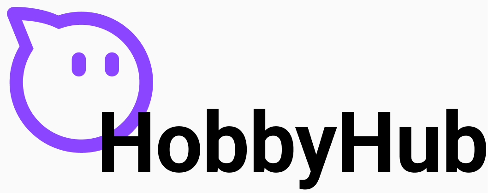
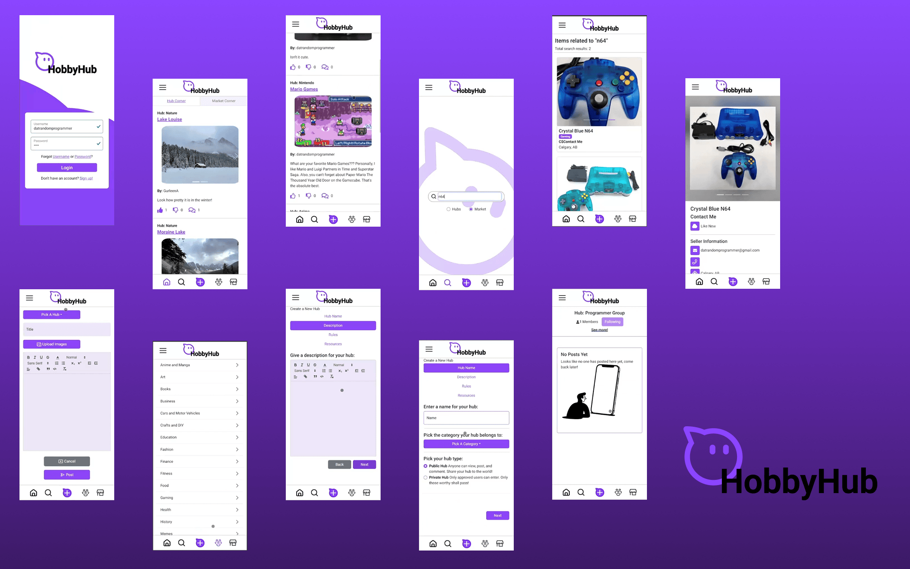
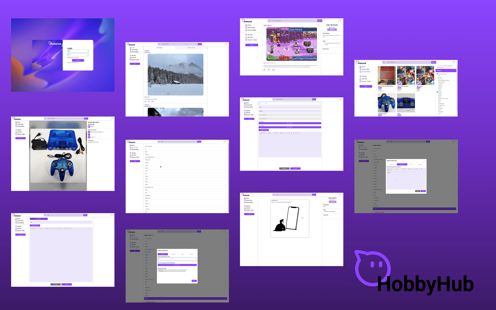

<a id="readme-top"></a>

<div align="center">
  <a href="https://github.com/michelle-loi/HobbyHub">
    
  </a>

  <h3 align="center">HobbyHub</h3>
  <p align="left">
      HobbyHub is a social media platform that combines community forums and a dedicated marketplace for hobbyists. Users can join or create hobby-based groups to discuss, share content, and connect with others, while also buying, selling, and trading related items—all in one place.
  </p>
  <a href="https://github.com/michelle-loi/HobbyHub"><strong>Explore the docs »</strong></a>
  <br/>
  <br/>
  <p>
    
    
  </p>
</div>

<!-- TABLE OF CONTENTS -->
  <details>
    <summary>Table of Contents</summary>
    <ol>
      <li>
        <a href="#about-the-project">About The Project</a>
        <ul>
          <li><a href="#built-with">Built With</a></li>
        </ul>
      </li>
      <li>
        <a href="#video-demo">Video Demo</a>
      </li>
      <li>
        <a href="#getting-started">Getting Started</a>
      </li>
      <li>
        <a href="#startup-instructions">Startup Instructions</a>
      </li>
      <li>
        <a href="#alternative-methods-to-starting-without-docker">Alternative Methods to Starting without Docker</a>
      </li>
      <li><a href="#acknowledgments">Acknowledgments</a></li>
    </ol>
  </details>

<!-- ABOUT THE PROJECT -->

## About The Project





<p align="right">(<a href="#readme-top">back to top</a>)</p>

### Built With

- [![React][React.js]][React-url]
- [![React Router][ReactRouter]][ReactRouter-url]
- [![React Bootstrap][ReactBootstrap]][ReactBootstrap-url]
- [![Node.js][Node.js]][Node-url]
- [![Express.js][Express.js]][Express-url]
- [![MongoDB][MongoDB]][MongoDB-url]

<p align="right">(<a href="#readme-top">back to top</a>)</p>

<!-- DEMO -->
## Video Demo

Curious about the project? Check out the demo video below:

[](https://youtu.be/gkAzxe4Fj9I)

<p align="right">(<a href="#readme-top">back to top</a>)</p>

## Getting Started

### Database Seeding Scripts

- To populate the MongoDB Database with seed data, refer to the instructions in the README.md file in the DBSeedingScripts directory.

```
/api/DBSeedingScripts
```

### API (directory)

1. From the root directory `cd api`
2. Within the api directory create a file called .env (you will only have to make this .env file once).
3. Inside this file you will write

```.env
MONGO = <Mogo DB connection URL> (Replace the <> with the connection settings from Mongodb)

JWT = <replace with webstoken password>
```

### Root Directory

1. From the root directory create a file called .env (you will only have to make this .env file once).
2. Inside this file you will write

```.env
MONGO = <Mogo DB connection URL> (Replace the <> with the connection settings from Mongodb)

JWT = <replace with webstoken password>
```

<p align="right">(<a href="#readme-top">back to top</a>)</p>

## Startup Instructions

Before any startup you must have and start the docker engine on your computer, this is most commonly tied to starting up the docker
desktop application.

1. cd into the root directory of the project
2. For the first startup (after pulling the project from GIT) enter: `docker-compose up --build` to build the project and start it with docker
3. Afterwards you may enter: `docker-compose up` to start the project with docker
4. To stop the project you may enter: `docker-compose down` or `ctrl + c`
5. Then on an internet browser go to: http://localhost:5173/ to access the front end

<p align="right">(<a href="#readme-top">back to top</a>)</p>

## Alternative Methods to Starting without Docker

### Client side

1. From the root directory

   ```
   cd client
   ```

2. Install dependencies

   ```
   npm install
   ```

3. Start up frontend

   ```
   npm run dev
   ```

### Server (api) side

1. From the root directory

   ```
   cd api
   ```

2. Install dependencies

   ```
   npm install
   ```

3. Start api

   ```
   npm start
   ```

<p align="right">(<a href="#readme-top">back to top</a>)</p>

<!-- ACKNOWLEDGMENTS -->

## Acknowledgments

### ReadMe Template

- [Best-README-Template](https://github.com/othneildrew/Best-README-Template/blob/main/BLANK_README.md#about-the-project)

<p align="right">(<a href="#readme-top">back to top</a>)</p>

<!-- Badge Links -->

[React.js]: https://img.shields.io/badge/React-61DAFB?style=for-the-badge&logo=react&logoColor=white
[React-url]: https://reactjs.org/
[ReactRouter]: https://img.shields.io/badge/React_Router-CA4245?style=for-the-badge&logo=react-router&logoColor=white
[ReactRouter-url]: https://reactrouter.com/
[ReactBootstrap]: https://img.shields.io/badge/React_Bootstrap-7952B3?style=for-the-badge&logo=bootstrap&logoColor=white
[ReactBootstrap-url]: https://react-bootstrap.netlify.app/
[Node.js]: https://img.shields.io/badge/Node.js-339933?style=for-the-badge&logo=nodedotjs&logoColor=white
[Node-url]: https://nodejs.org/
[Express.js]: https://img.shields.io/badge/Express.js-000000?style=for-the-badge&logo=express&logoColor=white
[Express-url]: https://expressjs.com/
[MongoDB]: https://img.shields.io/badge/MongoDB-47A248?style=for-the-badge&logo=mongodb&logoColor=white
[MongoDB-url]: https://www.mongodb.com/
